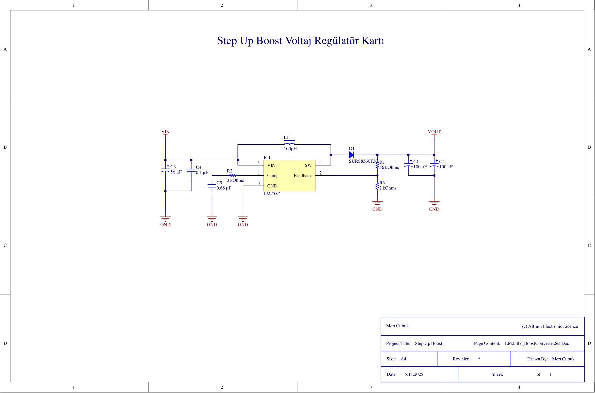
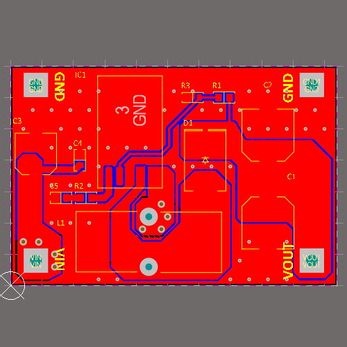
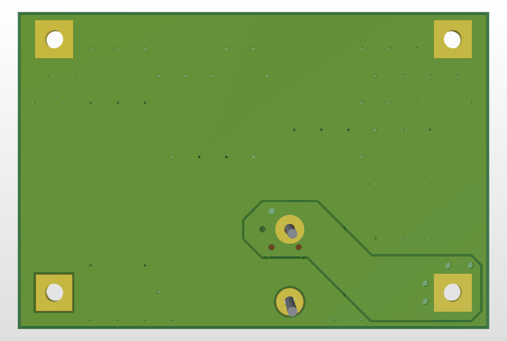
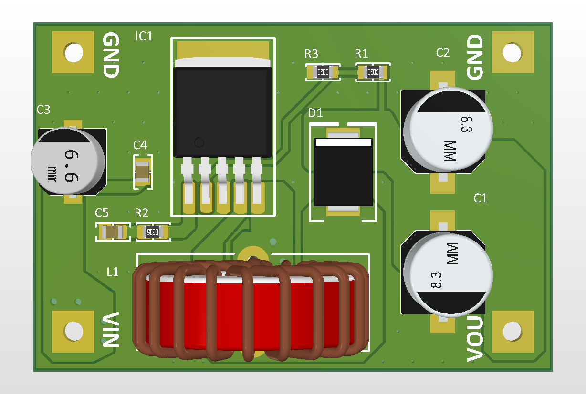

# LM2587 Boost Converter PCB (18–24V → 36V @ 2A)

Bu proje, Texas Instruments LM2587-ADJ anahtarlamalı regülatör entegresi kullanılarak  
**18–24V girişten 36V / 2A çıkış** elde eden bir *boost converter* devresinin PCB tasarımıdır.

Tasarımın ana amacı:  
- **Altium Designer pratik geliştirme**,  
- aynı zamanda datasheet’e uygun, kararlı çalışan bir boost topolojisi elde etmektir.


## ⚙️ Teknik Özellikler

| Özellik                  | Açıklama                                            |
| ------------------------ | --------------------------------------------------- |
| **Giriş Gerilimi (VIN)** | 18 V – 24 V DC                                      |
| **Çıkış Gerilimi**       | 36 V DC (R1–R2 feedback oranı ile sabit)            |
| **Maksimum Çıkış Akımı** | 2 A (tasarım örnek devre ile uyumlu)                |
| **Verim**                | %80 – %92                                           |
| **Anahtarlama Frekansı** | ~100 kHz                                            |
| **Endüktör**             | 100 µH, Isat ≥ 2.5–3 A (*datasheet önerisi*)        |
| **Diyot**                | Schottky / Fast Recovery 60–100 V / 3–5 A (MUR420 vb.) |
| **Kapasitörler**         | Giriş: 56 µF, Çıkış: 2×100 µF (low ESR)             |
| **Kart Boyutu**          | **52 mm × 35 mm**                                   |
| **Katman Sayısı**        | 2 katman (Top / Bottom)                             |
| **Tasarım Aracı**        | Altium Designer 24.2                                |
| **Üretim Durumu**        | Gerber çıkışı hazır, JLCPCB uyumlu                  |


## 🗂️ Proje Yapısı

```text
📂 LM2587_BoostConverter
 ┣ 📜 LM2587_BoostConverter.PrjPcb
 ┣ 📜 LM2587_BoostConverter.SchDoc
 ┣ 📜 LM2587_BoostConverter.PcbDoc
 ┣ 📜 LM2587_BoostConverter.SchLib
 ┣ 📜 LM2587_BoostConverter.PcbLib
 ┣ 📜 README.md
 ┣ 📜 .gitignore
 ┣ 📂 Gerber_LM2587_v1
 ┃ ┗ 📦 Üretim dosyaları (Gerber, NC Drill, JLCPCB uyumlu)
 ┣ 📂 images
 ┃ ┣ 🖼️ LM2587_BoostConverter_Schematic.png
 ┃ ┣ 🖼️ LM2587_BoostConverter_Top2D.png
 ┃ ┣ 🖼️ LM2587_BoostConverter_Bottom2D.png
 ┃ ┣ 🖼️ LM2587_BoostConverter_Top3D.png
 ┃ ┗ 🖼️ LM2587_BoostConverter_Bottom3D.png
 ┗ 📂 Project Outputs for LM2587_BoostConverter
   ┣ 📜 BOM.xlsx
   ┣ 📜 Design Rule Check - LM2587_BoostConverter.html
   ┗ 📂 Gerber / NC Drill / STEP dosyaları
 
```

## 🖼️ Görseller

| Görsel                               		                 | Açıklama         |
| :------------------------------------------------------ | :--------------- |
| 	 	   | Şematik görünümü |
|   		  | PCB Top Layer    |
| 	 | PCB Bottom Layer |
|      		 | 3D Üst Görünüm   |
| 		     | 3D Alt Görünüm   |


📚 Öğrenilenler / Kazanımlar


-LM2587 boost topolojisi ve feedback direnç hesaplaması

-Yüksek akım yollarında layout planlama (SW node kısaltma, loop alanı küçültme)

-Giriş–çıkış kondansatörlerinin konumlandırılma kritikleri

-Uygulama notu/datasheet inceleyerek PCB tasarımını birebir aktarma

-GND akım yollarını ayırma ve star ground konsepti

-Altium’da 3D model yönetimi, tasarım kuralları (DRC) ve Gerber oluşturma


🧠 Notlar


-Diyot seçimi boost devrelerinde kritik → forward recovery + ters toparlanma süresi kısa olmalıdır.

-Endüktör Isat değeri iki kat güvenlik ile seçilmiştir (datasheet önerisi: ≥2.5 A).

-SW düğümü (IC pin 4) çevresindeki bakırın genişliği EMI açısından minimize edilmiştir.

-Tüm komponent 3D modelleri Celestial Altium Library veya üretici kütüphanelerinden alınmıştır.

---

© 2025 Mert Çubuk  
*Designed and documented with Altium Designer 24.2*  
